## 5G System

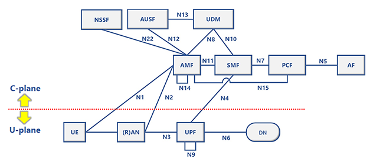

### 5Gコア (5GC)

上図のUE、\(R\)AN除いた各ノードをまとめて `5Gコア (5GC)` と呼ぶ。
`5Gコア (5GC)`を`交換機`と呼ぶこともある。

### 各ノードの概要

- NSSF (Network Slice Selection Function: スライスごとのSMFの選択）
- AUSF (Authentication Server Function: subscriber認証用サーバ）
- UDM (Unified Data Management: subscriber関連情報の保持）
- AMF (Access and Mobility Management Function: subscriber認証・セキュリティ、端末の位置管理）
- SMF (Session Management Function: セッション管理）
- PCF (Policy Control Function: ポリシー制御）
- AF (Application Function: 外部アプリケーションサーバ）
- UE (User Equipment: 端末）
- **\(R\)AN (Radio Access Network: （無線）アクセス網）**
- UPF (User Plane Function: ユーザーデータのパケット転送）
- DN (Data Network: 5GC外部のデータネットワーク（インターネット等））

### エッジコンピューティングへの対応

中央集権型のクラウドコンピューティングに比べ、NW負荷、遅延の面で有利。
必要な処理をデータが生まれた場所のなるべく近くで処理し、クラウドとの通信を減らす。

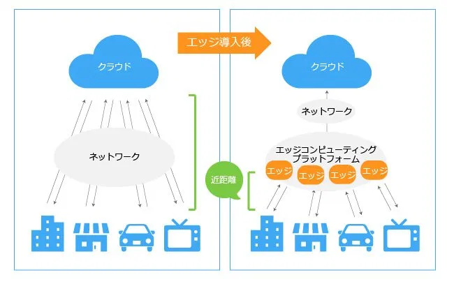

5G Systemもエッジコンピューティングに対応できるようにUPFを分散配置できる。
UEから物理的に近いUPFを使用すればエッジコンピューティングの恩恵を受けやすい。

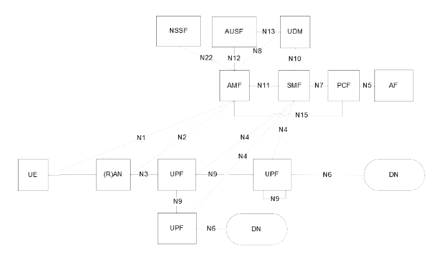

## \(R\)AN

Radio Access Networkの略。
UEに対して5GCとの無線アクセスを提供する。

5GのRANは `NG-RAN(Next Generation RAN)` と呼ばれる。

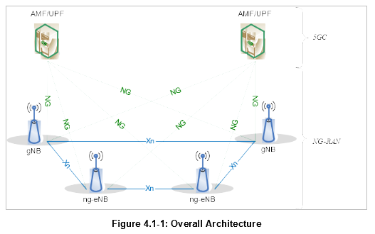

### 各ノードの概要

- AMF/UPF (5GCノードでNG-RANに接続されるノード)
- gNB (gNodeB: 5G基地局 NRによるC-Plane/U-PlaneアクセスをUEに提供する)
- ng-eNB (ng-eNodeB: LTE基地局 E-UTRAによるC-Plane/U-PlaneアクセスをUEに提供し、
  gNBと接続する能力がある)

無線アクセス方式において5GとLTEは `NR`、`E-UTRA` という呼び方で区別される。

### スタンドアローンとノンスタンドアローン

ここまで説明したRAN構成はスタンドアローン構成。
5GCとgNBの構成で5G無線アクセスを提供するのがスタンドアローン構成。

#### ノンスタンドアローン

LTEの無線アクセスネットワークをベースに、gNBを組み合わせて5G無線アクセスを提供する構成。

LTEのコアネットワークは `EPC` 、無線アクセスネットワークは `E-UTRAN` と呼ばれる。

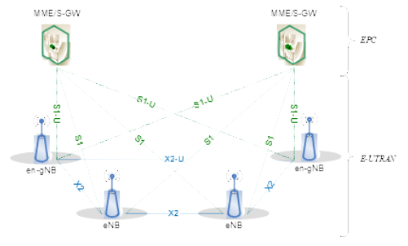

##### 各ノードの概要

- MME/S-GW (5GCノードでNG-RANに接続されるノード)
- eNB (eNodeB: LTE基地局 E-UTRAによるC-Plane/U-PlaneアクセスをUEに提供する)
- en-gNB (en-gNodeB: 5G基地局 NRによるC-Plane/U-PlaneアクセスをUEに提供し、
  eNBと接続する能力がある)

## gNB

gNBはUEに対して無線アクセス経由での5GCアクセスを提供する基地局。
そのために以下の機能を持つ。

- UEに対する無線リソース割当
- UPFへのU-Planeデータルーティング
- AMFへのC-Planeデータルーティング
- 接続中UEのモビリティ(移動)制御
- などなど

### CU-DU分割

gNBはCUとその下にぶら下がる複数のDUで構成される。

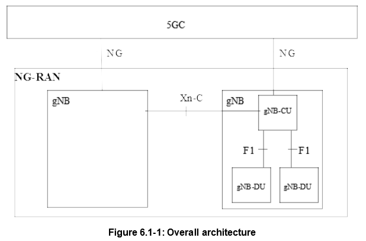

CUについてC-PlaneとU-Planeで分割した構成も規定されている。

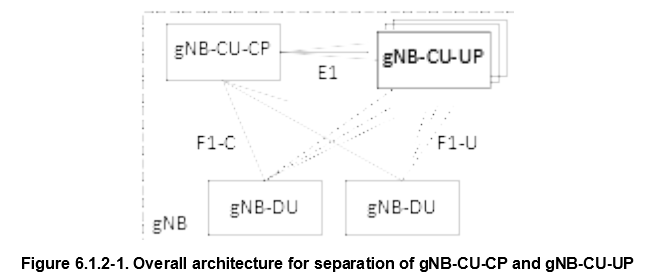

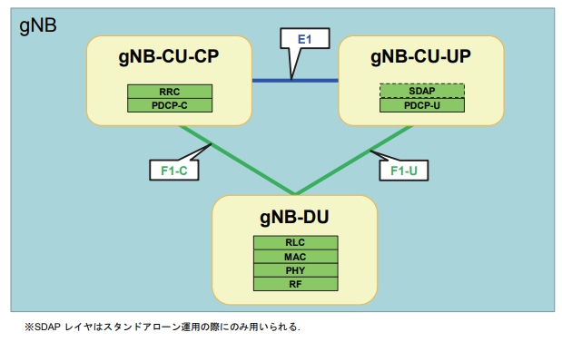

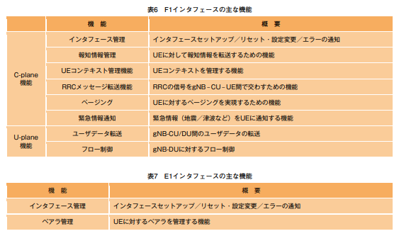

### セル

各DUの先には無線装置(RU:Radio Unit)が存在し、電波を発信している。
各RUの電波の届く範囲を `セル` といい、カバーする範囲によって複数の種類がある。

- マクロセル 半径十数Km
- スモールセル 半径数百m
- マイクロセル 不明
- ピコセル 不明
- フェムトセル Wi-Fiと変わらないくらい

＃ 厳密な規定は存在していない模様

1つの基地局に多数のUEが接続すると、混雑による繋がりにくさや通信速度の低下につながるので、
人口密集地にはマイクロセルやピコセルを配置する。

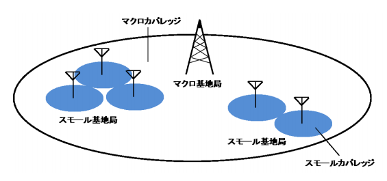

### ビームフォーミング

5Gでは通信効率の高い周波数の高い電波を使用する。
周波数の高い電波は遠くまで飛ばない性質があるため、ビームフォーミングという技術で電波を
ビーム状にし遠くまで届くようにする。
すると今度は広い範囲をカバーできなくなるため、複数のビームを発信することでカバー範囲を
広げるらしい。

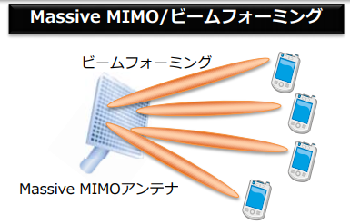

1つのセルが複数のビームを発信すると解釈している。

### Dual Connectivity

Master Node(MN)、Secndary Node(SN)と呼ばれる2つのセル(DU/RU)を使用し、U-Planeデータを
複数のセルから送信するすることが可能。

- EN-DC (E-UTRA-NR Dual Connectivity eNBがMN、gNBがSN)
- NE-DC (NR-E-UTRA Dual Connectivity gNBがMN、eNBがSN)
- NR-DC (NR-NR Dual Connectivity gNBがMN、gNBがSN)

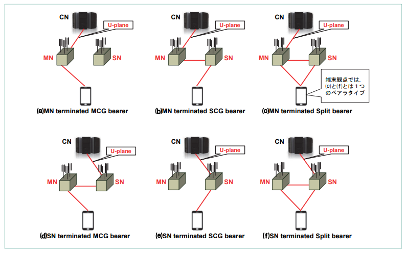

### ハンドオーバ

UEが物理的に移動し、現在在圏しているセルから別のセルに移動する際、ハンドオーバが発生する。
UEは定期的に周囲のセルの電波強度を計測し、gNBに報告している(Measuremnet Report)。
gNBは計測結果からより電波状況の良いセルへと通信経路を切り替える。

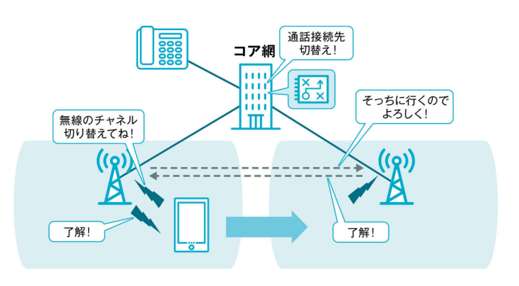

### gNBのサブレイヤ

#### U-Plane

U-Plane伝送をを行うgNBのサブレイヤは以下。
UE側にも同様にピアとなるサブレイヤが存在する。

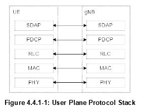

#### C-Plane

C-Plane伝送をを行うgNBのサブレイヤは以下。
UE側にも同様にピアとなるサブレイヤが存在する。

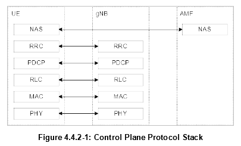

#### SDAP

- QoSフローと無線ベアラのマッピング
- DL/ULパケットへのQoSフローIDマーキング

1つのPDUセッション毎にSDAPエンティティが作成される。

#### RRC

- ASやNASに関連するシステム情報のブロードキャスト
- 5GCまたはNG-RANによって開始されたページング
- UEとNG-RANとの間のRRC接続の確立、維持及び解放
  - キャリアアグリゲーションの追加、変更およびリリース
  - NR-DC、またはEN-DCの追加、変更、および解放
- 鍵管理を含むセキュリティ機能
- シグナリング無線ベアラ（SRB）およびデータ無線ベアラ（DRB）の確立、設定、保守およびリリース
- モビリティ機能
  - モビリティ機能：ハンドオーバおよびコンテキスト転送を含む
  - UEによるセル選択と再選択の制御
  - RAT間モビリティ
- QoS管理機能
- UE測定レポートおよびレポートの制御
- 無線リンク障害の検出と回復
- UEとの間でのNASメッセージの送受信

#### PDCP

- U-Plane/C-Planeのデータ転送
- PDCPシーケンス番号の管理
- ROHCを使用したヘッダー圧縮、非圧縮
- 暗号化と解読
- 完全性の保護と検証
- タイマーベースのSDU廃棄
- スプリットベアラのためのルーティング
- PDCP duplication
- 受信データの並び替え
- 順不同受信
- 重複廃棄

#### RLC

-	Transparent Mode \(TM\)
-	Unacknowledged Mode (UM)
-	Acknowledged Mode (AM)

RLC 構成は、論理チャネルごとにnumerologyや伝送期間に依存せず、
ARQは論理チャネルが構成されているnumerologyや伝送期間で動作します。

SRB0(ページングおよびブロードキャストシステム情報)については、TMモードが使用される。
その他のSRBでは、AMモードが使用されます。
DRBでは、UMモードまたはAMモードが使用されます。

#### MAC

- 論理チャネルとトランスポートチャネル間のマッピング
- 1つまたは異なる論理チャネルに属するMACSDUを、トランスポートチャネルで物理層に
  配信されるトランスポートブロック（TB）へ多重化
- トランスポートチャネルで物理層から配信されたトランスポートブロック（TB）を、
  1つまたは異なる論理チャネルに属するMACSDUに逆多重化
- スケジューリング情報の報告
- HARQによるエラー訂正（CAの場合は1セルにつき1つのHARQエンティティ)
- ダイナミックスケジューリングによるUE間の優先度処理
- 論理チャネル優先順位付けによる１つのUEの論理チャネル間の優先順位処理
- パディング

1つのMACエンティティは、複数のnumerology、送信タイミング、セルをサポートすることができる。
logical channel prioritisationにおけるマッピングの制限は、論理チャネルが使用できるnumerology、
セル、および送信タイミングを制御する。
