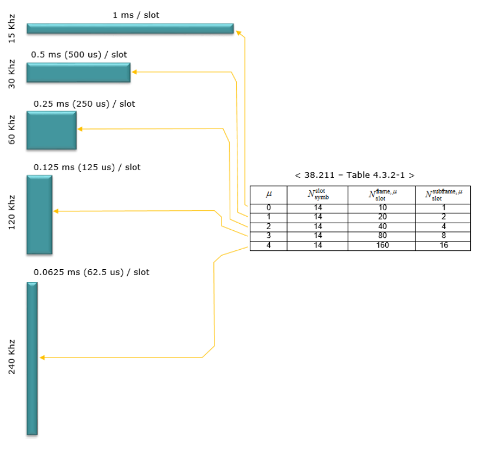
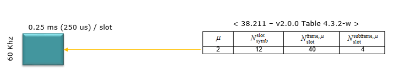
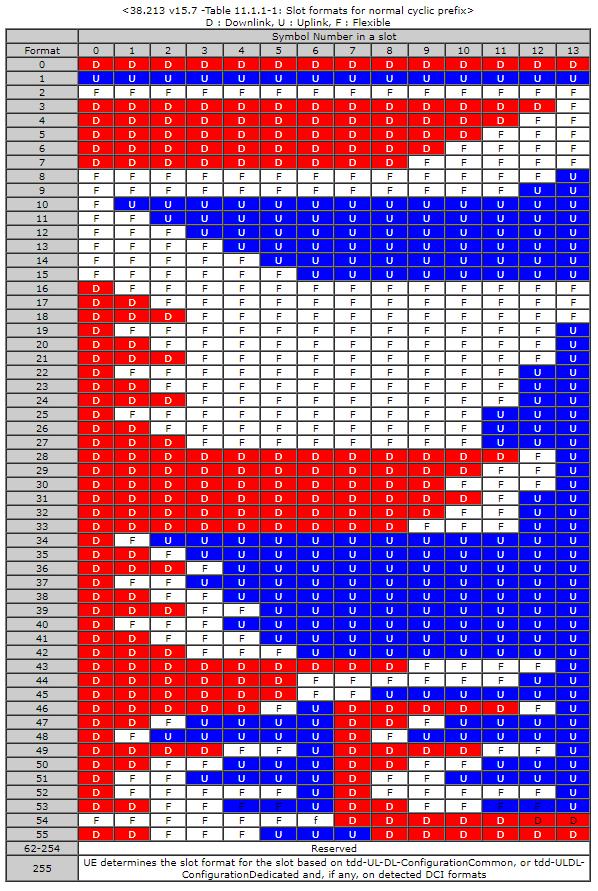

# NR フレーム構造

## サブキャリア間隔

NRはLTEと同じくOFDM: Orthogonal Frequency Division Multiplexing(直交周波数分割多重方式)を採用。  
LTEではサブキャリア間隔が15kHz固定だったが、NRでは複数のサブキャリア間隔が定義されている。

1つのサブキャリアは1つのフレームで構成される。  
1フレームは10個のサブフレームで構成される。  
サブフレームは1個以上のスロットで構成される。  
スロットは14のOFDMシンボルで構成される。  
**サブキャリアが12本束ねられ、1リソースブロック(RB)となる。**

## スロット長

サブキャリア間隔により、サブフレームに含まれるスロット数が変わる。  
つまり1スロットの長さ(時間)が変わる。  

サブキャリア間隔が広くなると、そのサブキャリアで使用できる周波数帯域が広くなるので、時間あたりの伝達量が増加する。  
このため、1サブフレームに含められるスロット数が増加する。

サブキャリア間隔が広がると周波数帯域(上下)が広がり、同じ情報量を伝達するのに必要な時間(左右)が短くなる。  

サブキャリア間隔15kHzを基準にスケールを表すパラメータ `numerology` は`μ`として表現される。  

$$
2^{μ} \\times 15kHz = サブキャリア間隔
$$

全てのサブキャリア間隔を全ての物理チャネルに信号に適用出来るわけではない。  
PSS、SSS、PBCHではμ={0,1,3,4}がサポートされ、その他のチャネルはμ={0,1,2,3}がサポート。

  
(3GPP TS38.300 v15.10.0)

## スロットフォーマット

スロット内のシンボルがどのように使用されるか定義したフォーマットが規定されている。

## 参考

-   NTT Docomo Technology Report 5GにおけるNR物理レイヤ仕様  
    <https://www.nttdocomo.co.jp/binary/pdf/corporate/technology/rd/technical_journal/bn/vol26_3/vol26_3_009jp.pdf>
-   ShareTechnote 5G/NR - Frame Structure  
    <https://www.sharetechnote.com/html/5G/5G_FrameStructure.html>
