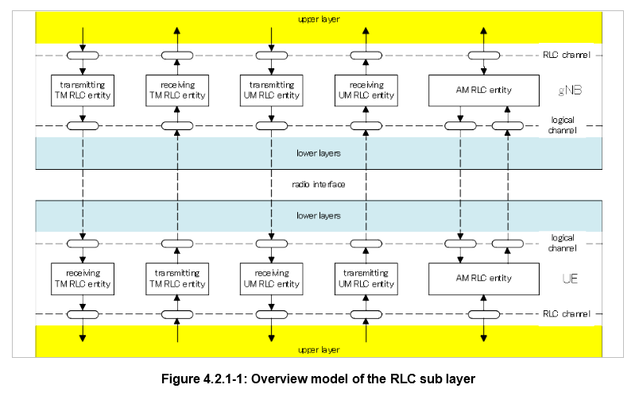
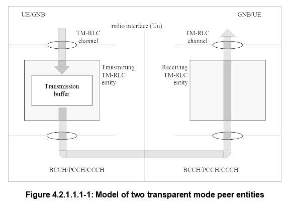
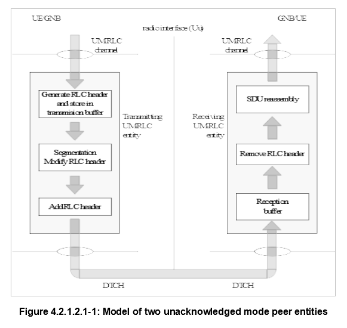
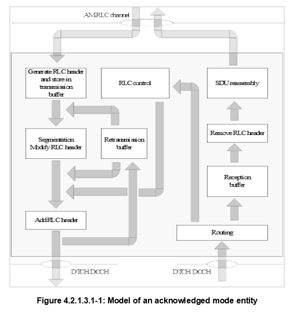

# NR RLC

## 4	General

### 4.2.1. RLC entities

RLCはRRCによってコンフィグされる。  
RLCサブレイヤの機能はRLCエンティティによって実行される。  
gNBのRLCのピアとして、UEにもRLCが存在する。  

RLC PDUは2種類存在する。

-   RLC Data PDU
-   RLC Control PDU

RLCには3つのモードが存在し、それぞれのモードを提供するRLCエンティティが存在する。

-   Transparent Mode (TM)
-   Unacknowledged Mode (UM)
-   Acknowledged Mode (AM)

TM, UMについては送信、受信それぞれにエンティティが存在するが、AMは1つのエンティティで送信、受信を行う。

各モードと論理チャネルのマッピングは以下。

| LogCh/Mode | TM | UM | AM |
| ---------- | -- | -- | -- |
| BCCH       | O  | X  | X  |
| PCCH       | O  | X  | X  |
| DL/UL CCCH | O  | X  | X  |
| DL/UL DTCH | X  | O  | O  |
| DL/UL DCCH | X  | X  | O  |

#### RLC SDU

いずれのモードでもRLCエンティティが上位とやりとりするデータを **RLC SDU** と呼ぶ。  
(8bit単位にバイトアライメントされた可変長データ)

#### RLC PDU

RLCエンティティが下位とやり取りするデータを **RLC PDU** と呼ぶ。  
RLC SDUを基にRLC PDUを作成するが、その際、MACからの送信機会通知を待たなくても良い。  
ただし、UM, AMの場合、MACからの送信機会通知で通知される送信サイズに基づいてセグメント化を行わなくてはならない。  
RLC PDUはMACからの送信機会通知があった場合のみ、MACに送信することが出来る。

### 4.2.1.1 TM RLC entity

以下の論理チャネルでの通信に使用される。

-   BCCH
-   DL/UL CCCH
-   PCCH

TM RLCエンティティが送受信するRLC PDUを **TMD PDU** と呼ぶ。

#### 4.2.1.1.2	Transmitting TM RLC entity

RLC SDUのセグメント化は行わない。  
TMD PDUにRLCヘッダーを付与しない。

#### 4.2.1.1.3	Receiving TM RLC entity

TMD PDUをそのままRLC SDUとして上位に渡す。

### 4.2.1.2	UM RLC entity

以下の論理チャネルでの通信に使用される。

-   DL/UL DTCH

UM RLCエンティティが送受信するRLC PDUを **UMD PDU** と呼ぶ。  
UMD PDUは1つのRLC SDU、またはセグメント化されたRLC SDUを持つ。

#### 4.2.1.2.2	Transmitting UM RLC entity

RLC SDUにRLCヘッダーを付与し、UMD PDUを作成する。  
MACから送信機会通知を受けた際、UMD PDUが通知された送信サイズに収まらない場合、RLC SDUをセグメント化し、RLCヘッダーを更新する。

#### 4.2.1.2.3	Receiving UM RLC entity

受信UM RLCエンティティは以下を行う。

-   下位レイヤでのRLC SDUセグメント損失の検出。
-   受信したUMD PDUからRLC SDUを組み立て、完成したら上位へ渡す。
-   下位レイヤでのUMD PDU損失によりRLC SDUを組み立てできない場合、UMD PDUを破棄する。

### 4.2.1.3	AM RLC entity

以下の論理チャネルでの通信に使用される。

-   DL/UL DCCH
-   DL/UL DTCH

AM RLCエンティティが送受信するRLC PDUを **AMD PDU** と呼ぶ。  
AMD PDUは1つのRLC SDU、またはセグメント化されたRLC SDUを持つ。  
また、AM RLCエンティティは **STATUS PDU** というRLC Control PDUも送受信する。

#### 4.2.1.3.2	Transmitting side

RLC SDUにRLCヘッダーを付与し、AMD PDUを作成する。  
MACから送信機会通知を受けた際、AMD PDUが通知された送信サイズに収まらない場合、RLC SDUをセグメント化し、RLCヘッダーを更新する。  
AM RLCエンティティはRLC SDU、RLC SDUセグメントの再送(ARQ)をサポートする。  

-   再送対象のRLC SDU、RLC SDUセグメントがMACから通知された送信サイズに収まらない場合、RLC SDUはセグメント化、RLC SDUセグメントは再セグメント化する。
-   RLD SDUセグメントの再セグメント化は上限なく可能。

#### 4.2.1.3.3	Receiving side

受信AM RLCエンティティは以下を行う。

-   AMD PDUの重複を検出し、重複したAMD PDUを破棄する。
-   下位レイヤでのAMD PDUの損失の検出と、再送要求。
-   受信したAMD PDUからRLC SDUを組み立て、完成したら上位へ渡す。

### 4.3.1	Services provided to upper layers

RLCが上位に提供するサービス。

-   TMデータ転送
-   UMデータ転送
-   AMデータ転送と、上位への送信成功通知

### 4.3.2	Services expected from lower layers

RLCがMACに期待するサービス

-   データ転送
-   送信機会の通知と、送信可能RLC PDUサイズの通知

### 4.4	Functions

RLCがサポートする機能。

-   上位レイヤPDUの転送
-   ARQによるエラー訂正(というか再送要求)(AMのみ)
-   RLC SDUセグメント化と再組み立て(UM/AMのみ)
-   RLC SDUセグメントの再セグメント化(AMのみ)
-   重複検出(AMのみ)
-   RLC SDUの破棄(UM/AMのみ)
-   RLC再確立
-   プロトコルエラー検出(AMのみ)

## 5	Procedures

### 5.1.1	RLC entity establishment

上位レイヤからのRLCエンティティ確立要求により、以下を行う。

-   RLCエンティティの確立
-   全ての状態変数の初期化
-   データ転送プロシージャの開始(5.2節)

### 5.1.2	RLC entity re-establishment

上位レイヤからのRLCエンティティ再確立要求により、以下を行う。

-   全てのRLC SDU、RLC SDUセグメント、RLC PDUの破棄
-   全てのタイマーの停止、リセット
-   全ての状態変数の初期化

### 5.1.3	RLC entity release

上位レイヤからのRLCエンティティ解放要求により、以下を行う。

-   全てのRLC SDU、RLC SDUセグメント、RLC PDUの破棄
-   RLCエンティティの解放

### 5.2.1	TM data transfer

#### 5.2.1.1	Transmit operations

TMD PDUをMACに送信する際、TM RLCエンティティは以下を行う。

-   RLC SDUに何も変更を加えず、MACへ渡す

#### 5.2.1.2	Receive operations

MACからTMD PDUを受信した際、TM RLCエンティティは以下を行う。

-   TMD PDUに何も変更を加えず、MACへ渡す
